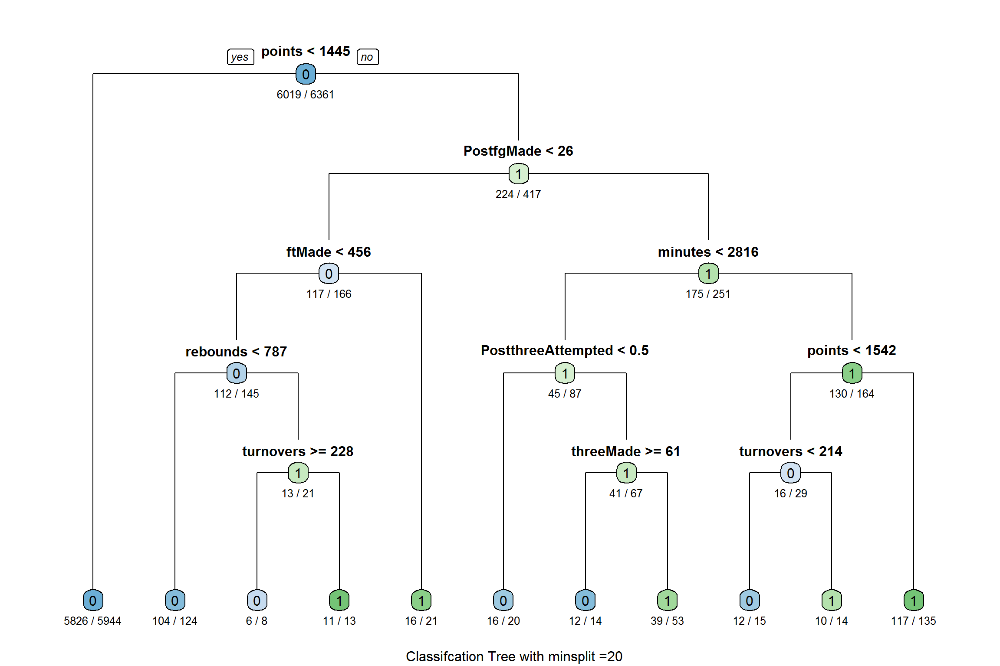

# Popularity vs. Ability: Exploring the Legitimacy of NBA All-star Voting Process


## Intro
NBA 올스타들을 선수들의 경기력과 무관하게, 그 선수가 얼마나 팬들을 보유하고 있느냐에 따라 결정된다는 비판의 여론은 끊이지 않습니다.  예를 들어, 코비 브라이언트는 잦은 부상과 그저 그런 경기를 치러도 거의 모든 시즌의 올스타에 당선되었죠.

이런 여론과 많은 팬들의 비난들에 저는 궁금했습니다. '과연 올스타들을 그들의 경기력과 무관하게 정말 팬들의 표에 따라 좌지우지 되는가?'

그 물음에 답하고자, 1980년부터 최근까지 농구선수들의 데이터를 가지고 과연 그들의 경기력 (골 포인트, 도움, 3점 슛 시도 횟수, 3점 슛 성공 횟수 etc.)이 올스타가 되는데 영향을 미치는지 알아보겠습니다.

NBA All-star had repeatedly come under strong criticism from many players, fans, and other important stakeholders alike. There are players like Kobe Bryant, who benefits from his long-standing popularity and reputation and was voted as one of the 2015 NBA All-star players despite of the mediocre season battling with constant injuries. On the other hand, there are players like Damian Lillard and Demarcus Cousins, who do not receive as much attention from media and recognition from fans and did not make it to the 2015 NBA All-star team despite of superb and record-breaking season. Damian Lillard famously tweeted, “I’m definitely going to take it personal. I said I’d be pissed off about it, and I am.” 

This controversy around NBA All-star voting stems from its voting process, which selects NBA All-star players solely relying on the Internet and text message ballot from the fans. By utilizing fan voting, the current voting process suffers from couple systematic problems: 
1. Only a very small percentage of fan votes is from NBA followers or experts. It automatically leads to uninformed popularity contest rather than basing it on ability.  
2. Celebrities, or anyone who are opinion leaders, also influence the voting by endorsing a player of the same demographic, such as nationality.
Due to these reasons, many expressed their dissatisfaction toward and questioned the legitimacy of NBA All-star events in general. Dallas Mavericks owner, Mark Cuban, has claimed that the NBA should get rid of the fan ballot entirely.

With the NBA All-star games always being the the source of contention, it leads to the important question: does popularity trump ability when it comes to the NBA All-star? In other words, are basketball statistics/high performance good predictors to determine if a player will make it into the NBA All-star team? The purpose of this project is to explore the predictability of various basketball statistics on whether a player will make it into the NBA All-star team or not. The results from this project will help better evaluate the strength and the legitimacy of the current voting process and will appeal to various stakeholders of the NBA, ranging from the fans and the players to the NBA commission and the team owners. The next section, methodology, will cover different steps I took to collect, cleanse, and analyze the data and the thought-process behind each step. Then the results of the data mining will be presented and discussed at the end of the paper. 

##Methodology
###Data Collection
We gathered two different NBA basketball datasets from KDNuggets.com. The first dataset (D1), basketballplayers, is the detailed basketball stats records of every single NBA player in each year from 1950 to 2009. Each observation in D1 is a player in one season, and the attributes include typical basketball stats measurements such as points, rebounds, assists, blocks, etc. The second dataset (D2), ‘basketball_allstar,’ is the similar to the first dataset but the data are limited to only all-star players. Just as it was described in D1, D2’s observations are all-star players in each season, and the attributes characterizing these observations are the same as D1. 
Data Cleansing and Preprocessing
The first step of data preprocessing was merging D1 and D2 together, so that there is one consolidated dataset (D3) with every single NBA player in each year with the additional attribute that indicates if respective player was in the All-star team or not in that given year. This merging was done in the Excel spreadsheet.

The next step involved working with missing data and dirty data. GS (games started) column was removed since all the values were 0 in all observations. I dropped all observations before the year of 1980, since the merger between NBA and ABA happened in 1976, because before that, the way basketball statistics were measured and recorded was different between those two leagues. For the sake of easier data analysis, I dropped everything before 1980. Furthermore, after data exploration, I found that the list of All-star players in 1998 is empty, so I decided to exclude the year 1998 as well.

The final dataset that had been “cleaned” up has a total of 36 variables. Only 32 out of those 36 variables will be utilized as predictors for the analysis. There was a total of 685 All-star player appearances between 1980 to 2009, except 1998. Summary statistics on those 32 predictors are shown below:


```
##    playerID year tmID lgID GP minutes points rebounds assists steals blocks turnovers  PF fgAttempted fgMade
## 1 abdulka01 1980  LAL  NBA 80    2976   2095      821     272     59    228       249 244        1457    836
## 2 abernto01 1980  GSW  NBA 10      39      4        8       1      1      0         2   5           3      1
## 3 abernto01 1980  IND  NBA 29     259     59       40      18      6      3         6  29          56     24
## 4 adamsal01 1980  PHO  NBA 75    2054   1115      546     344    106     69       226 226         870    458
## 5 allumda01 1980  DAL  NBA 22     276     59       65      25      5      8        23  51          67     23
## 6 archina01 1980  BOS  NBA 80    2820   1106      176     618     75     18       265 201         766    382
##   ftAttempted ftMade threeAttempted threeMade PostGP PostGS PostMinutes PostPoints PostRebounds PostAssists PostSteals
## 1         552    423              1         0      3      0         134         80           50          12          3
## 2           3      2              0         0      0      0           0          0            0           0          0
## 3          19     11              1         0      0      0           0          0            0           0          0
## 4         259    199              0         0      7      0         218         74           41          26          4
## 5          22     13              1         0      0      0           0          0            0           0          0
## 6         419    342              9         0     17      0         630        266           28         107         13
##   PostBlocks PostTurnovers PostPF PostfgAttempted PostfgMade PostftAttempted PostftMade PostthreeAttempted
## 1          8            11     14              65         30              28         20                  0
## 2          0             0      0               0          0               0          0                  0
## 3          0             0      0               0          0               0          0                  0
## 4          1            19     20              60         27              28         20                  0
## 5          0             0      0               0          0               0          0                  0
## 6          0            50     39             211         95              94         76                  5
##   PostthreeMade Allstar
## 1             0       1
## 2             0       0
## 3             0       0
## 4             0       0
## 5             0       0
## 6             0       1
```

## Classification Analysis


```r
#Select a random sample of our data to use as our training data set. 
#Put 50% of the data in training and 50% in test.
ind = sample(1:nrow(dat),floor(nrow(dat)*0.50)) 
dat_train = dat[ind,] 
dat_test = dat[-ind,]
ind = sample(1:nrow(dat),floor(nrow(dat)*0.50)) 
dat_train = dat[ind,] 
dat_test = dat[-ind,]
```


```r
#Load rpart and rpart.plot library in order to perform prediction analysis by using regression tree.
library(rpart)
library(rpart.plot)
```

### Decision Tree
I explored the strength of decision trees by changing the minsplit parameters between 10, 20, and 60. Confusion matrices were utilized to calculate accuracy, precisions, and recalls. It is important to note that I prioritize the predictability of someone making into All-star team than not making into one. Furthermore, I believe that FN is more costly than FP, because most of the dissatisfactions from stakeholders are caused by well-deserved players not making to the team.


```r
#First, try split the data at minimum split value of 20.
# Minsplit says don't split if you have fewer than 20 observations left in the branch from the training data.
tree_1<-rpart(Allstar ~ GP+ minutes+ points+ rebounds+ assists+ steals+ blocks+ turnovers
              + PF+ fgAttempted+ fgMade+ ftAttempted+ ftMade+ threeAttempted+ threeMade+ PostGP
              + PostMinutes+ PostPoints+ PostRebounds+ PostAssists+ PostSteals+ PostBlocks
              + PostTurnovers+ PostPF+ PostfgAttempted+ PostfgMade+ PostftAttempted+ PostftMade
              + PostthreeAttempted+ PostthreeMade,
              data=dat_train,method = "class",control = rpart.control(minsplit = 20))

#Draw regression tree using rpart.plot
rpart.plot(tree_1,type = 1,extra=2,under=TRUE)
title(sub="Classifcation Tree with minsplit =20 ")
```




```r
#Try minsplit=10
tree_2<-rpart(Allstar ~ GP+ minutes+ points+ rebounds+ assists+ steals+ blocks+ turnovers
              + PF+ fgAttempted+ fgMade+ ftAttempted+ ftMade+ threeAttempted+ threeMade+ PostGP
              + PostMinutes+ PostPoints+ PostRebounds+ PostAssists+ PostSteals+ PostBlocks
              + PostTurnovers+ PostPF+ PostfgAttempted+ PostfgMade+ PostftAttempted+ PostftMade
              + PostthreeAttempted+ PostthreeMade,
              data=dat_train,method = "class",control = rpart.control(minsplit = 10))
rpart.plot(tree_2,type = 1,extra=2,under=TRUE)
title(sub="Classifcation Tree with minsplit =10 ")
```


```r
#Try minsplit=60
tree_3<-rpart(Allstar ~ GP+ minutes+ points+ rebounds+ assists+ steals+ blocks+ turnovers
              + PF+ fgAttempted+ fgMade+ ftAttempted+ ftMade+ threeAttempted+ threeMade+ PostGP
              + PostMinutes+ PostPoints+ PostRebounds+ PostAssists+ PostSteals+ PostBlocks
              + PostTurnovers+ PostPF+ PostfgAttempted+ PostfgMade+ PostftAttempted+ PostftMade
              + PostthreeAttempted+ PostthreeMade,
              data=dat_train,method = "class",control = rpart.control(minsplit = 60))
rpart.plot(tree_3,type = 1,extra=2,under=TRUE)
title(sub ="Classifcation Tree with minsplit =60 ")
```


```r
#Predict the classification of each observation in the test data, using the three trees that I built.
dat_test1<- dat_test
dat_test2<- dat_test
dat_test3<- dat_test

dat_test1$pred <- predict(tree_1,dat_test, type="class")
dat_test2$pred <- predict(tree_2,dat_test, type="class")
dat_test3$pred <- predict(tree_3,dat_test, type="class")

#Now let's check out our confusion matrix to see how the tree did. 
confusionmatrix1<-table(dat_test1$Allstar,dat_test1$pred,dnn = c("Actual","Predicted"))
confusionmatrix2<-table(dat_test2$Allstar,dat_test2$pred,dnn = c("Actual","Predicted"))
confusionmatrix3<-table(dat_test3$Allstar,dat_test3$pred,dnn = c("Actual","Predicted"))

confusionmatrix1
```

```
##       Predicted
## Actual    0    1
##      0 5957   73
##      1  180  152
```

```r
confusionmatrix2
```

```
##       Predicted
## Actual    0    1
##      0 5957   73
##      1  180  152
```

```r
confusionmatrix3
```

```
##       Predicted
## Actual    0    1
##      0 5973   57
##      1  188  144
```


```r
Accuracy<-(confusionmatrix1[1,1]+confusionmatrix1[2,2])/sum(confusionmatrix1)
Accuracy
```

```
## [1] 0.9602326
```

```r
#precisions
Precision_N<-confusionmatrix1[1,1]/(confusionmatrix1[1,1]+confusionmatrix1[2,1])
Precision_P<-confusionmatrix1[2,2]/(confusionmatrix1[2,2]+confusionmatrix1[1,2])
Precision_N
```

```
## [1] 0.9706697
```

```r
Precision_P
```

```
## [1] 0.6755556
```

```r
#recalls
Recall_N<-confusionmatrix1[1,1]/(confusionmatrix1[1,1]+confusionmatrix1[1,2])
Recall_P<-confusionmatrix1[2,2]/(confusionmatrix1[2,2]+confusionmatrix1[2,1])
Recall_N
```

```
## [1] 0.9878939
```

```r
Recall_P
```

```
## [1] 0.4578313
```

## Conclusion

Decision Tree 알고리즘이 꽤 정확하게 올스타 선수들과 올스타가 아닌 선수들을 꽤 정확하게 구분 할 수 있다는 점에서, 우리는 올스타 선수들의 팬덤만이 아닌  "객관적인 경기력"이 올스타가 되는데 굉장히 중요하다는 걸 알 수 있습니다.

It is not surprising to discover that All-star players in general have better basketball statistics than non-All-star players, because it is only intuitive to conclude that the popularity of a given player is positively correlated with his ability to play basketball. It was interesting to find the high discrepancy in the number of All-star players throughout the team. I did not take the establishment of each team into consideration, but it is safe to assume that the probability of making into the All-star team is different from one team to another due to their popularity, fan base, and ability.

Through the decision tree and the K-NN model, I found that basketball statistics are relatively reliable information to predict whether a player will make into the All-star team or not. In terms of predicting if someone will NOT make the team, both techniques were highly accurate and viable (precision and recall both over 97%). This, as it was mentioned, is not very meaningful, since there are simply more players who do not get selected into the All-star team thus much higher chance of not making it.  They had more difficulty in predicting if someone will make the team, as the decision tree had precision and recall of 62% and 55% and K-nn had 69% and 49%. The fact the recalls are so low would be quite costly if these models were to be deployed since false negative in this case would cause a lot of dissatisfaction among stakeholders, more so that false positive. 

All in all, the fact that basketball statistics are somewhat reliable information to predict someone’s chance at making the All-star team indicates that the current NBA All-star voting process is not as bad as what people think. This is based on the widely accepted notion that popularity is positively correlated to one’s ability to play basketball. There always will be outliers, such as Kobe Bryant making it to the All-star team, but I can safely conclude that in general players who are fan voted to join the All-star team are definitely talented, superior to, and perform far better than non-All-star players.


